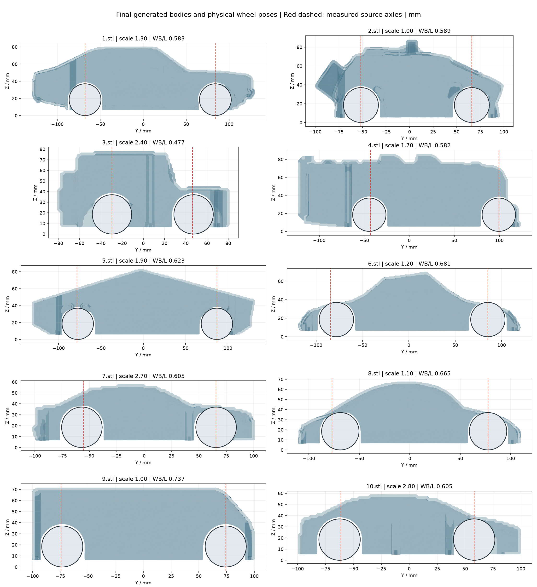

# 验证记录与边界

## 仓库可运行性

仓库带有 Windows 安装检查和 CI：按 `uv.lock` 新建环境，验证原始输入哈希，实际执行 CAD STEP 导入导出、Manifold 体积、Embree 射线、CP-SAT 和 PNG 渲染，再执行完整几何单元回归与默认模型分析。

安装报告写入 `reports/install_check.json`，pytest 可通过 `test.cmd -q --junitxml=reports/tests.xml` 保存记录。CI 验证软件运行，并不认证每个输出小车可制造。

完整克隆与设计实测记录将在首次发布验证后补充。

## 历史整车回归：release-v14

该轮测试冻结的几何算法处理过 10 个实际 STL，共 19 次结构评估。10 例轴距、轮位检查通过；7 例没有正式 FAIL，3 例仍有局部薄壁。固定最小壁厚为 1.6 mm，未为通过而修改阈值。

| 模型 | 正式 PASS / FAIL / WARNING | 壁厚采样最小值 mm |
|---|---|---:|
| 1.stl | 210 / 0 / 24 | 2.050622 |
| 2.stl | 210 / 0 / 24 | 2.099998 |
| 3.stl | 210 / 0 / 24 | 1.895768 |
| 4.stl | 210 / 0 / 24 | 2.042944 |
| 5.stl | 210 / 1 / 23 | 0.135314 |
| 6.stl | 210 / 1 / 23 | 1.163377 |
| 7.stl | 210 / 0 / 24 | 2.055124 |
| 8.stl | 210 / 0 / 24 | 1.876691 |
| 9.stl | 210 / 0 / 24 | 2.063699 |
| 10.stl | 210 / 1 / 23 | 0.236182 |

原来的轮子拥挤问题通过源模型双侧轮位提取、两排轮子联合搜索、独立轴距/外露/轮拱对应检查修复；轮心不是预设坐标。

独立审计重新读取 40 个打印 STL 与 40 个对应 3MF 网格，拓扑均通过；检查 90 个主要硬件节点和 130 条已建模连续装配路径；复测 1,342,518 条上壳壁厚射线，重现上述三例失败。射线采样并非全局壁厚证明。

原机器 32 GB 内存、两个模型并行并伴随诊断，单例耗时 14.4–84.2 分钟，中位数 21.7 分钟；一轮结构评估的七例中位数 17.6 分钟。不同机器和输入不能套用相同耗时。

五份单位不明的极小文件（1、2、6、8、9）使用明确记录的初始车长 200 mm 诊断假设，硬件保持真实尺寸。所有结果 `release_ready=false`；未完成真实轮毂、线束、切片试印与硬件试装。

十模型完整几何、逐次失败、日志及源码快照在此前提供的独立工程归档中，未把约 1.85 GB 历史输出塞入 Git 仓库。该归档 SHA256：`fc6f759dbafa868ca28a6eddbade437d360f37c5b0bb034bb2feaa4c9915a5c3`。本页历史结果不代表新配置或新依赖已自动获得相同整车结论。
